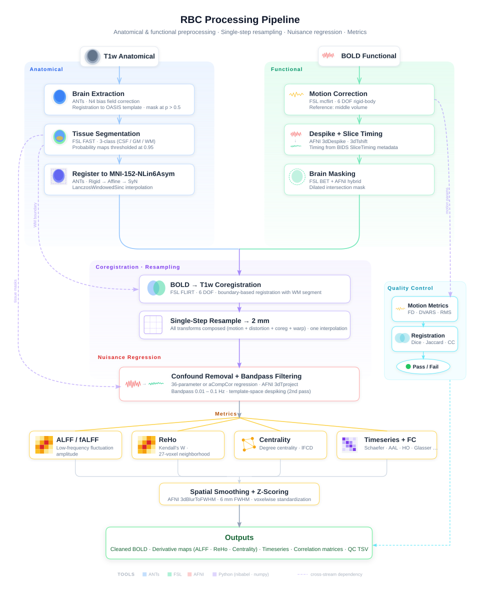

# RBC Pipeline

[](https://github.com/childmindresearch/rbc/actions/workflows/test.yaml?query=branch%3Amain)
[](https://github.com/astral-sh/ruff)
[](https://github.com/childmindresearch/rbc/blob/main/LICENSE)
[](https://childmindresearch.github.io/rbc)

> [!WARNING]
> This software is under active development and not yet intended for production use. APIs, outputs, and behavior may change without notice. Use at your own risk.

Reference implementation of the [Reproducible Brain Charts (RBC)](https://doi.org/10.1016/j.neuron.2024.08.026) preprocessing protocol for structural and functional MRI. Built on [NiWrap](https://github.com/styx-api/niwrap).

<p align="center">
  
</p>

## Installation

```bash
pip install git+https://github.com/childmindresearch/rbc.git
```

Requires Python 3.12+. Neuroimaging tools (AFNI, FSL, ANTs) are needed at runtime. Pass `--runner docker` to pull and run them automatically via containers. See the [NiWrap docs](https://github.com/styx-api/niwrap) for runner configuration.

## Quick start

```bash
# Usage example
# rbc <input_dir> <output_dir> <workflow> [options]

# Run the full pipeline
rbc /data /data/derivatives all --runner docker

# Or run a single stage for specific subjects
rbc /data /data/derivatives functional --task rest --participant-label 01 02 --runner docker
```

Run any command with `--help` for full options.

## Workflows

| Command          | Description                                                                                      |
| ---------------- | ------------------------------------------------------------------------------------------------ |
| `rbc anatomical` | Brain extraction (ANTs), tissue segmentation (FSL FAST), registration to MNI152                  |
| `rbc functional` | Motion correction, slice timing, BBR coregistration, single-step resampling, nuisance regression |
| `rbc metrics`    | ALFF/fALFF, ReHo, smoothing, z-scoring, atlas-based timeseries and correlation matrices          |
| `rbc qc`         | XCP-D format quality metrics, framewise displacement, DVARS, RBC pass/fail thresholds            |
| `rbc all`        | Runs all four stages in sequence, passing results in memory between stages                       |

Workflows must be run in order: `anatomical` → `functional` → `metrics` / `qc`. The `all` command handles this automatically.

## Outputs

See the [data dictionary](docs/data_dictionary.md) for a complete description of every output file, including format details and the processing step that produces each one.

<details>
<summary>Example BIDS derivative tree</summary>

```
derivatives/rbc/
  sub-01/
    ses-01/
      anat/
        sub-01_ses-01_desc-brain_T1w.nii.gz
        sub-01_ses-01_desc-T1w_mask.nii.gz
        sub-01_ses-01_desc-{csf,gm,wm}_mask.nii.gz
        sub-01_ses-01_from-T1w_to-template_mode-image_xfm.nii.gz
        sub-01_ses-01_from-template_to-T1w_mode-image_xfm.nii.gz
      func/
        sub-01_ses-01_task-rest_desc-preproc_bold.nii.gz
        sub-01_ses-01_task-rest_space-MNI152NLin6ASym_desc-preproc_bold.nii.gz
        sub-01_ses-01_task-rest_space-MNI152NLin6ASym_reg-36parameter_desc-preproc_bold.nii.gz
        sub-01_ses-01_task-rest_desc-motionParams_motion.1D
        sub-01_ses-01_task-rest_space-MNI152NLin6ASym_reg-36parameter_desc-xcp_quality.tsv
        sub-01_ses-01_task-rest_space-MNI152NLin6ASym_reg-36parameter_alff.nii.gz
        sub-01_ses-01_task-rest_space-MNI152NLin6ASym_reg-36parameter_reho.nii.gz
        sub-01_ses-01_task-rest_space-MNI152NLin6ASym_atlas-schaefer200_reg-36parameter_desc-mean_timeseries.tsv
        sub-01_ses-01_task-rest_space-MNI152NLin6ASym_atlas-schaefer200_reg-36parameter_desc-pearson_correlations.tsv
```

</details>

## Testing

```bash
# Unit tests (fast, no runner needed)
uv run pytest -m unit

# Integration tests (requires Docker)
uv run pytest -m "integration and not slow" --runner docker

# Full pipeline (~30+ min)
uv run pytest -m full_pipeline --runner docker
```

See [tests/README.md](tests/README.md) for the full testing strategy.

## Contributing

```bash
uv sync && uv run pre-commit install
```

See [CONTRIBUTING.md](CONTRIBUTING.md) for guidelines.

## Citation

If you use this pipeline, please cite:

```bibtex
@article{shafiei2025reproducible,
  title={Reproducible Brain Charts: An open data resource for mapping brain development and its associations with mental health},
  author={Shafiei, Golia and Esper, Nathalia B. and Hoffmann, Mauricio S. and Ai, Lei and Chen, Andrew A. and Cluce, Jon and Covitz, Sydney and Giavasis, Steven and Lane, Connor and Mehta, Kahini and Moore, Tyler M. and Salo, Taylor and Tapera, Tinashe M. and Calkins, Monica E. and Colcombe, Stanley and Davatzikos, Christos and Gur, Raquel E. and Gur, Ruben C. and Pan, Pedro M. and Jackowski, Andrea P. and Rokem, Ariel and Rohde, Luis A. and Shinohara, Russell T. and Tottenham, Nim and Zuo, Xi-Nian and Cieslak, Matthew and Franco, Alexandre R. and Kiar, Gregory and Salum, Giovanni A. and Milham, Michael P. and Satterthwaite, Theodore D.},
  journal={Neuron},
  volume={113},
  number={22},
  pages={3758--3779.e6},
  year={2025},
  publisher={Elsevier},
  doi={10.1016/j.neuron.2025.08.026}
}
```

## About RBC

[Reproducible Brain Charts (RBC)](https://reprobrainchart.github.io/) is an open resource integrating data from 5 large studies of brain development in youth from three continents (N = 6,346). The resource provides:

- Harmonized psychiatric phenotypes using bifactor models
- Quality-assured neuroimaging data processed with consistent pipelines
- All data openly shared via the International Neuroimaging Data-sharing Initiative (INDI)

RBC facilitates large-scale, reproducible, and generalizable research in developmental and psychiatric neuroscience. The RBC pipeline was developed originally in the [Configurable Pipeline for the Analysis of Connectomes](https://github.com/FCP-INDI/C-PAC/), and has been remade here using NiWrap to increase readability, portability, and runtime efficiency.

## License

[MIT License](LICENSE)

## Acknowledgments

This implementation is based on the RBC protocol described in Shafiei et al. (2025) and originally implemented in [C-PAC](https://fcp-indi.github.io/). Development is supported by the [Child Mind Institute](https://childmind.org).
